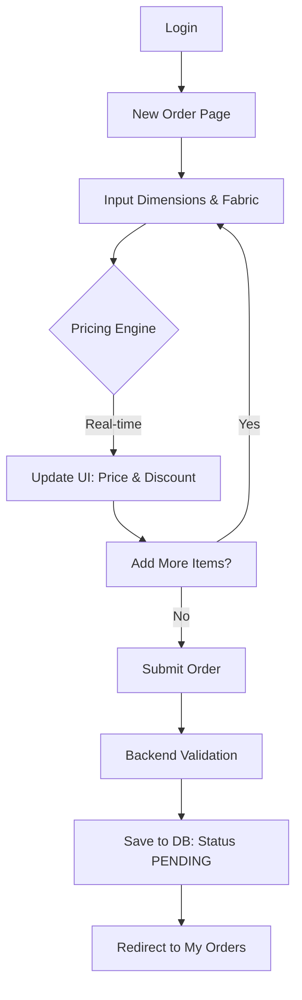
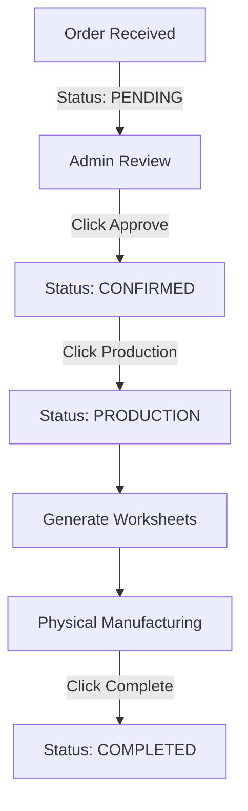

# Signature Shades: System & User Process Flow

This document provides a highly structured, technical breakdown of the Signature Shades Order System. It is designed for both human developers and AI models to understand the logic, data flow, and current state of the application.

---

## 1. System Architecture Overview

The system transitions from an **Excel-based legacy workflow** to a **Web-Integrated Interactive Order Builder**.

### Core Tech Stack
- **Frontend:** React (Vite), Tailwind CSS, React Hook Form, TanStack Query.
- **Backend:** Node.js, Express, Prisma (PostgreSQL).
- **Communication:** REST API with JWT Authentication.

---

## 2. Order Creation Lifecycle (Customer)

### Flow Diagram

### Technical Detail: Pricing Engine (Frontend)
- **Logic Location:** `f:\SIGNATUR SHADES\signature-sap\frontend\src\utils\pricing.ts`
- **Algorithm:**
    1.  **Fabric Mapping:** Maps `Material` + `Fabric Range` to a `Fabric Group` (G1-G5).
    2.  **Dimension Matching:** Rounds input `Width` and `Drop` to the nearest available matrix values (rounding up if exactly between).
    3.  **Lookup:** Retrieves base price from `PRICING_DATA` matrix.
    4.  **Discount Logic:**
        - G1: 20% Discount
        - G2: 25% Discount
        - G3: 30% Discount
        - G4/G5: (Custom or 0% depending on tier)

### Technical Detail: Submission (API)
- **Endpoint:** `POST /api/web-orders`
- **Data Model:**
    - `Order`: General metadata (customer, total price, status).
    - `OrderItem`: 16 specific fields including `location`, `width`, `drop`, `material`, `fabricType`, `fabricColour`, `controlSide`, `roll`, `chainOrMotor`, `fixing`, `bracketType`, `bracketColour`, `bottomRailType`, `bottomRailColour`.

---

## 3. Order Management Lifecycle (Admin)

### Flow Diagram

### Technical Detail: Worksheet Calculations
When an order is moved to production, the system generates technical manufacturing dimensions:
- **Fabric Cut Width:** `Ordered Width - 35mm`
- **Tube Cut Width:** `Ordered Width - 28mm`
- **Calculated Drop:** `Ordered Drop + 150mm` (Buffer for roll)

---

## 4. Pending Development Roadmap

| Feature Area | Task Description | Priority |
| :--- | :--- | :--- |
| **Inventory UI** | Build Quantity Adjustment interface and Transaction History viewer. | High |
| **Inventory Alerts** | Implement visual "Low Stock" markers on the dashboard. | Medium |
| **Branding** | Embed high-resolution company logo in PDF headers. | Medium |
| **Security** | Full audit of JWT scopes and API rate limiting. | High |
| **Automated Tests** | Write Vitest/Cypress tests for the pricing engine and order flow. | Medium |
| **Customer Portal**| Create "Quick Quote" tool and Order Status Timeline. | Low |

---

## 5. Development Maintenance Context (for AI)
- **Primary Configuration:** `docker-compose.yml` (Handles DB, Backend, Frontend).
- **Schema Reference:** `f:\SIGNATUR SHADES\signature-sap\backend\prisma\schema.prisma`.
- **API Entry:** `f:\SIGNATUR SHADES\signature-sap\backend\src\routes\orderRoutes.ts` & `webOrderRoutes.ts`.
