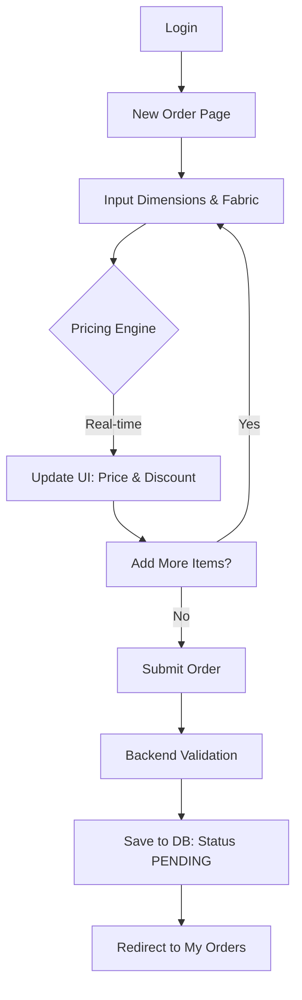
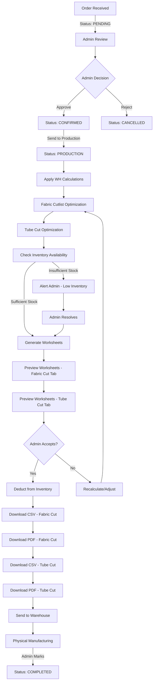

# Signature Shades: System & User Process Flow (Updated v2.0)

This document provides a highly structured, technical breakdown of the Signature Shades Order System with **Cutlist Optimization** and **Tube Cut Logic** integration.

---

## 1. System Architecture Overview

The system transitions from an **Excel-based legacy workflow** to a **Web-Integrated Interactive Order Builder** with **Intelligent Fabric Optimization**.

### Core Tech Stack
- **Frontend:** React (Vite), Tailwind CSS, React Hook Form, TanStack Query
- **Backend:** Node.js, Express, Prisma (PostgreSQL)
- **Communication:** REST API with JWT Authentication
- **Optimization:** Guillotine 2D Bin Packing Algorithm for fabric cutting

---

## 2. Order Creation Lifecycle (Customer)

### Flow Diagram


### Technical Detail: Pricing Engine (Frontend)
- **Logic Location:** `frontend\src\utils\pricing.ts`
- **Algorithm:**
    1. **Fabric Mapping:** Maps `Material` + `Fabric Range` to a `Fabric Group` (G1-G5)
    2. **Dimension Matching:** Rounds input `Width` and `Drop` to nearest matrix values (rounding up if exactly between)
    3. **Lookup:** Retrieves base price from `PRICING_DATA` matrix
    4. **Discount Logic:**
        - G1: 20% Discount
        - G2: 25% Discount
        - G3: 30% Discount
        - G4/G5: 0% (or custom based on tier)

### Technical Detail: Submission (API)
- **Endpoint:** `POST /api/web-orders`
- **Data Model:**
    - `Order`: General metadata (customer, total price, status)
    - `OrderItem`: 16 specific fields including `location`, `width`, `drop`, `material`, `fabricType`, `fabricColour`, `controlSide`, `roll`, `chainOrMotor`, `fixing`, `bracketType`, `bracketColour`, `bottomRailType`, `bottomRailColour`, `discountPercent`, `price`

---

## 3. Order Management Lifecycle with Optimization (Admin)

### Enhanced Flow Diagram


---

## 4. Warehouse Calculations & Optimization Logic

### 4.1 Pre-Optimization Calculations (Fabric Cut Only)

**Applied BEFORE cutlist optimization:**

```
For each blind item in the order:
  Calculated Width  = Original Width - 28mm
  Calculated Drop   = Original Drop + 150mm
```

**Example:**
- Original: 1500mm × 2100mm
- Calculated: 1472mm × 2250mm

**Note:** These calculations apply ONLY to fabric dimensions, NOT to tube cut dimensions.

---

### 4.2 Fabric Cutlist Optimization

#### Algorithm: Guillotine 2D Bin Packing

**Input:**
- Multiple blind orders with calculated dimensions (after Width-28, Drop+150)
- Fabric roll specifications:
  - **Roll Width:** 3000mm (fixed for all fabrics)
  - **Roll Length:** Dynamic - current inventory quantity in mm for the specific fabric material

**Process:**

```
1. PREPARATION
   ├─ Extract all blinds with same fabric (Material + Fabric Type + Fabric Colour)
   ├─ Apply calculations: Width-28mm, Drop+150mm
   ├─ Group identical calculated sizes
   └─ Sort by area (largest first) - "First Fit Decreasing"

2. PACKING PROCESS (for each fabric type separately)
   For each panel:
   ├─ Try to fit in existing sheets
   │  ├─ Check normal orientation (calculated width × calculated drop)
   │  └─ Check rotated orientation (calculated drop × calculated width)
   │
   ├─ If fits → Place panel at (x, y)
   │  └─ Split remaining free space (Guillotine split)
   │
   └─ If doesn't fit → Create new sheet from roll

3. SPACE MANAGEMENT (Guillotine Split)
   When panel placed at (x, y):
   ├─ Create RIGHT rectangle (remaining width)
   └─ Create TOP rectangle (remaining length)
   └─ Merge overlapping free rectangles

4. VALIDATION
   ├─ Calculate total fabric needed (sheets × 10,000mm or roll length)
   ├─ Compare with available inventory quantity
   └─ Alert if insufficient stock
```

**Output:**
```javascript
{
  sheets: [
    {
      id: 1,
      width: 3000,
      length: 10000, // or available roll length
      panels: [
        {
          id: "0-0",
          x: 0,
          y: 0,
          width: 1472,
          length: 2250,
          rotated: false,
          label: "Living Room - 1500×2100",
          originalWidth: 1500,
          originalDrop: 2100
        },
        // ... more panels
      ],
      usedArea: 3312000,
      wastedArea: 6688000,
      efficiency: 33.12
    }
  ],
  statistics: {
    usedStockSheets: 3,
    totalUsedArea: 9500000,
    totalWastedArea: 20500000,
    wastePercentage: 42,
    efficiency: 58,
    totalFabricNeeded: 30000 // mm to deduct from inventory
  }
}
```

---

### 4.3 Tube Cut Optimization (Bottom Bar)

**Simple Linear Calculation (No 2D optimization needed)**

**Specifications:**
- **Bottom Bar Stock Length:** 5800mm per piece
- **Wastage Buffer:** 10% additional material

**Algorithm:**

```
1. GROUP BY BOTTOM BAR TYPE & COLOUR
   └─ Extract all blinds with same bottomRailType and bottomRailColour

2. CALCULATE TOTAL WIDTH (use ORIGINAL width, not calculated)
   Total Width = Σ(Original Width for all blinds in group)

3. CALCULATE QUANTITY NEEDED
   Base Quantity = Total Width ÷ 5800mm
   Wastage = Base Quantity × 10%
   Final Quantity = Base Quantity + Wastage

4. ROUND UP
   Bottom Bar Qty to Deduct = CEILING(Final Quantity)
```

**Examples:**

```
Example 1:
  Blinds: 3 blinds with D30 Anodised
    - 1500mm, 2200mm, 3400mm
  Total Width = 7100mm
  Base Quantity = 7100 ÷ 5800 = 1.224
  Wastage = 1.224 × 10% = 0.122
  Final = 1.224 + 0.122 = 1.346
  Deduct: 2 pieces (rounded up)

Example 2:
  Blinds: 15 blinds with Oval Black
    - Various widths totaling 90885mm
  Total Width = 90885mm
  Base Quantity = 90885 ÷ 5800 = 15.67
  Wastage = 15.67 × 10% = 1.567
  Final = 15.67 + 1.567 = 17.237
  Deduct: 18 pieces (rounded up)
```

**Output:**
```javascript
{
  groups: [
    {
      bottomRailType: "D30",
      bottomRailColour: "Anodised",
      blinds: [
        { location: "Living Room", originalWidth: 1500 },
        { location: "Bedroom 1", originalWidth: 2200 },
        { location: "Bedroom 2", originalWidth: 3400 }
      ],
      totalWidth: 7100,
      baseQuantity: 1.224,
      wastage: 0.122,
      finalQuantity: 1.346,
      piecesToDeduct: 2,
      stockLength: 5800
    }
  ],
  totalPiecesNeeded: 2
}
```

---

## 5. Worksheet Generation

### 5.1 Fabric Cut Worksheet

**Columns (14 total):**

| # | Column | Source | Notes |
|---|--------|--------|-------|
| 1 | Sheet # | Optimization output | Which fabric sheet (1, 2, 3...) |
| 2 | Position | Optimization output | (x, y) coordinates on sheet |
| 3 | Location | OrderItem.location | Room/area name |
| 4 | Original Width | OrderItem.width | Customer order dimension |
| 5 | Original Drop | OrderItem.drop | Customer order dimension |
| 6 | **Fabric Cut Width** | Width - 35mm | **CRITICAL: Different from calculated!** |
| 7 | Calculated Drop | Drop + 150mm | Manufacturing dimension |
| 8 | Control Side | OrderItem.controlSide | Left/Right |
| 9 | Control Colour | OrderItem.bracketColour | White/Black/etc. |
| 10 | Chain or Motor | OrderItem.chainOrMotor | Motor type or chain |
| 11 | Roll | OrderItem.roll | Front/Back |
| 12 | Fabric Type | OrderItem.fabricType | Fabric name |
| 13 | Fabric Colour | OrderItem.fabricColour | Colour name |
| 14 | Rotated | Optimization output | Yes/No if panel rotated 90° |

**Critical Note:**
- **Fabric Cut Width** = Original Width - 35mm (for fabric cutting)
- **Calculated Width** (stored in DB) = Original Width - 28mm (for tube cutting)
- These are DIFFERENT values!

**Grouping:**
- Group by Material + Fabric Type + Fabric Colour
- Each group gets separate optimization
- Each group shows separate sheet layout

---

### 5.2 Tube Cut Worksheet

**Columns (7 total):**

| # | Column | Source | Notes |
|---|--------|--------|-------|
| 1 | Location | OrderItem.location | Room/area name |
| 2 | Original Width | OrderItem.width | Customer order dimension |
| 3 | **Tube Cut Width** | Width - 28mm | **Uses calculated width from DB** |
| 4 | Bottom Rail Type | OrderItem.bottomRailType | D30/Oval |
| 5 | Bottom Rail Colour | OrderItem.bottomRailColour | Anodised/Black/etc. |
| 6 | Quantity Needed | Calculated | Per group |
| 7 | Stock Pieces | Calculated | Pieces to deduct from inventory |

**Grouping:**
- Group by Bottom Rail Type + Bottom Rail Colour
- Show total width calculation
- Show wastage calculation (10%)
- Show final pieces needed

---

## 6. Inventory Integration

### 6.1 Inventory Items Required

**Fabric Materials:**
- **Unit:** MM (millimeters)
- **Quantity:** Represents available roll length
- **Examples:**
  - Gracetech Vintage Pearl: 50,000mm available
  - Textstyle Sunscreen Grey: 35,000mm available

**Bottom Bars:**
- **Unit:** UNITS (pieces)
- **Stock Length:** 5800mm per piece
- **Examples:**
  - D30 Anodised: 25 pieces available
  - Oval Black: 18 pieces available

**Motors/Chains:**
- **Unit:** UNITS (pieces)
- **Examples:**
  - Automate 1.1NM Li-Ion: 15 pieces
  - TBS winder-32mm: 30 pieces

**Brackets:**
- **Unit:** UNITS (pieces)
- **Types:** Single, Single Extension, Dual Left, Dual Right
- **Colours:** White, Black, Sandstone, Barley, Silver Grey

---

### 6.2 Inventory Deduction Process

**Triggered When:** Admin accepts worksheets after "Send to Production"

**Deduction Logic:**

```javascript
// For each fabric group in order
deductFabric({
  itemName: `${material} - ${fabricType} - ${fabricColour}`,
  category: "Fabrics",
  quantityToDeduct: totalFabricNeededMm, // from optimization
  unit: "MM",
  notes: `Order ${orderNumber} - ${sheetsUsed} sheets, ${efficiency}% efficiency`,
  transactionType: "ORDER_DEDUCTION"
});

// For each bottom bar group
deductBottomBar({
  itemName: `${bottomRailType} - ${bottomRailColour}`,
  category: "Bottom Bars",
  quantityToDeduct: piecesToDeduct, // from tube cut calculation
  unit: "UNITS",
  notes: `Order ${orderNumber} - ${totalWidth}mm total, ${piecesToDeduct} pieces`,
  transactionType: "ORDER_DEDUCTION"
});

// For each motor/chain used
deductMotor({
  itemName: chainOrMotorValue,
  category: "Motors" or "Chains",
  quantityToDeduct: count,
  unit: "UNITS",
  notes: `Order ${orderNumber}`,
  transactionType: "ORDER_DEDUCTION"
});

// For brackets (if tracked)
deductBrackets({
  itemName: `${bracketType} - ${bracketColour}`,
  category: "Brackets",
  quantityToDeduct: count,
  unit: "UNITS",
  notes: `Order ${orderNumber}`,
  transactionType: "ORDER_DEDUCTION"
});
```

**Low Stock Alerts:**
- Check each item against threshold BEFORE deduction
- Alert admin if insufficient stock
- Block "Accept Worksheets" if stock unavailable
- Show required vs available for each item

---

## 7. Technical Implementation Details

### 7.1 File Structure

```
backend/
├── src/
│   ├── services/
│   │   ├── cutlistOptimizer.service.ts    # NEW: Fabric optimization
│   │   ├── tubeCutOptimizer.service.ts    # NEW: Bottom bar calculation
│   │   ├── worksheet.service.ts            # UPDATED: Uses optimizers
│   │   └── inventory.service.ts            # UPDATED: Handles deductions
│   ├── controllers/
│   │   └── order.controller.ts             # UPDATED: sendToProduction logic
│   └── routes/
│       └── orderRoutes.ts                  # Existing
frontend/
├── src/
│   ├── components/
│   │   ├── admin/
│   │   │   ├── WorksheetPreview.tsx        # NEW: Tab view component
│   │   │   ├── FabricCutWorksheet.tsx      # NEW: Shows optimization results
│   │   │   └── TubeCutWorksheet.tsx        # NEW: Shows tube calculations
│   └── pages/
│       └── admin/
│           └── OrderManagement.tsx          # UPDATED: Worksheet preview
cutlistOptimizer.js                          # REFERENCE: Algorithm logic
```

---

### 7.2 API Endpoints

**Existing:**
- `POST /api/web-orders/create` - Create order (status: PENDING)
- `PATCH /api/web-orders/:id/approve` - Approve order (status: CONFIRMED)

**Updated:**
- `POST /api/web-orders/:id/send-to-production` - Send to production + generate worksheets
  - Applies WH calculations (Width-28, Drop+150 for fabric)
  - Runs cutlist optimization per fabric group
  - Runs tube cut calculation per bottom bar group
  - Checks inventory availability
  - Returns worksheet data for preview
  - Does NOT deduct inventory yet

**New:**
- `GET /api/web-orders/:id/worksheets/preview` - Get worksheet preview data
- `POST /api/web-orders/:id/worksheets/accept` - Accept worksheets + deduct inventory
- `GET /api/web-orders/:id/worksheets/download/fabric-cut-csv`
- `GET /api/web-orders/:id/worksheets/download/fabric-cut-pdf`
- `GET /api/web-orders/:id/worksheets/download/tube-cut-csv`
- `GET /api/web-orders/:id/worksheets/download/tube-cut-pdf`
- `POST /api/web-orders/:id/recalculate` - Recalculate optimization (if admin rejects)

---

### 7.3 Database Schema Updates

**Add to OrderItem model:**

```prisma
model OrderItem {
  // ... existing fields ...
  
  // Optimization results (stored after Send to Production)
  sheetNumber         Int?      // Which fabric sheet (1, 2, 3...)
  sheetPositionX      Int?      // X coordinate on sheet
  sheetPositionY      Int?      // Y coordinate on sheet
  panelRotated        Boolean   @default(false)  // Was panel rotated 90°?
  
  // Tube cut results
  tubeQuantityNeeded  Decimal?  @db.Decimal(10, 3)  // Calculated pieces needed
  
  // Add timestamps
  optimizedAt         DateTime?
}
```

**Add new WorksheetData model (optional - for caching):**

```prisma
model WorksheetData {
  id              String   @id @default(uuid())
  orderId         String   @unique
  order           Order    @relation(fields: [orderId], references: [id])
  
  // Fabric optimization results (JSON)
  fabricCutData   Json     // Stores full optimization output
  
  // Tube cut results (JSON)
  tubeCutData     Json     // Stores tube calculations
  
  // Statistics
  totalFabricMm   Int      // Total fabric to deduct
  totalTubePieces Int      // Total bottom bar pieces
  
  acceptedAt      DateTime?
  acceptedBy      Int?
  
  createdAt       DateTime @default(now())
  updatedAt       DateTime @updatedAt
}
```

---

## 8. User Experience Flow (Admin)

### 8.1 Order Approval Flow

```
1. Admin opens order details
2. Reviews order items, customer info, totals
3. Clicks "Approve" button
   → Status changes to CONFIRMED
   → Success message shown
4. "Send to Production" button now enabled
```

---

### 8.2 Send to Production Flow

```
1. Admin clicks "Send to Production"
2. Backend processing (may take 5-10 seconds for large orders):
   ├─ Apply WH calculations (Width-28, Drop+150)
   ├─ Group by fabric types
   ├─ Run cutlist optimization for each fabric group
   ├─ Group by bottom bar types
   ├─ Calculate tube cut quantities
   ├─ Check inventory availability
   └─ Generate worksheet preview data

3. Frontend shows loading spinner:
   "Optimizing fabric cuts... Please wait"

4. On success:
   ├─ Status changes to PRODUCTION
   ├─ Modal/panel opens with worksheet preview
   └─ Shows tabbed interface:
       ├─ Tab 1: Fabric Cut Worksheet
       │   ├─ Shows cutting layout visualization (optional)
       │   ├─ Lists all cuts with sheet numbers
       │   ├─ Shows statistics (efficiency, waste, sheets used)
       │   └─ Shows fabric quantity to deduct
       └─ Tab 2: Tube Cut Worksheet
           ├─ Groups by bottom bar type/colour
           ├─ Shows total width calculations
           ├─ Shows wastage (10%)
           └─ Shows pieces to deduct

5. Admin reviews:
   ├─ Checks optimization results
   ├─ Verifies inventory deductions
   └─ Can switch between tabs

6. Admin decision:
   ├─ Accept → Inventory deducted, worksheets locked
   └─ Recalculate → Re-run optimization (rare)
```

---

### 8.3 Worksheet Download Flow

```
1. After accepting worksheets:
   ├─ Download buttons enabled
   ├─ Inventory already deducted
   └─ Worksheets are finalized

2. Admin downloads:
   ├─ Fabric Cut CSV (for digital systems)
   ├─ Fabric Cut PDF (for printing)
   ├─ Tube Cut CSV
   └─ Tube Cut PDF

3. Files sent to warehouse team
```

---

## 9. Testing Requirements

### 9.1 Cutlist Optimization Tests

**Test Cases:**

```javascript
// Test 1: Single blind (no optimization needed)
{
  blinds: [{ width: 1500, drop: 2100 }],
  expected: { sheets: 1, efficiency: ~10% }
}

// Test 2: Multiple identical blinds
{
  blinds: [
    { width: 1500, drop: 2100 },
    { width: 1500, drop: 2100 },
    { width: 1500, drop: 2100 }
  ],
  expected: { sheets: 1, efficiency: ~30% }
}

// Test 3: Mixed sizes
{
  blinds: [
    { width: 2400, drop: 2400 },
    { width: 1800, drop: 2100 },
    { width: 1200, drop: 1800 }
  ],
  expected: { sheets: 2, efficiency: 40-60% }
}

// Test 4: Large order (10+ blinds)
{
  blinds: [...15 various sized blinds...],
  expected: { sheets: 3-5, efficiency: 50-70% }
}

// Test 5: Rotation benefit
{
  blinds: [
    { width: 2800, drop: 1500 }, // Won't fit normal
    { width: 2800, drop: 1500 }  // Should rotate to fit
  ],
  expected: { someRotated: true }
}
```

---

### 9.2 Tube Cut Tests

**Test Cases:**

```javascript
// Test 1: Small total (< 1 piece)
{
  widths: [1500, 2200],
  totalWidth: 3700,
  expected: { piecesNeeded: 1 }
}

// Test 2: Exact multiple
{
  widths: [5800],
  totalWidth: 5800,
  expected: { piecesNeeded: 2 } // 1 + 10% = 1.1 → rounds to 2
}

// Test 3: Large order
{
  widths: [... totaling 90885mm ...],
  totalWidth: 90885,
  expected: { piecesNeeded: 18 }
}
```

---

### 9.3 Inventory Integration Tests

**Test Cases:**

```
Test 1: Sufficient Inventory
  Given: Order needs 30,000mm fabric, 50,000mm available
  When: Admin accepts worksheets
  Then: Inventory deducted to 20,000mm

Test 2: Insufficient Inventory
  Given: Order needs 30,000mm fabric, 20,000mm available
  When: Admin sends to production
  Then: Alert shown, "Accept" button disabled

Test 3: Multiple Fabric Types
  Given: Order has 3 different fabrics
  When: Optimization runs
  Then: Each fabric optimized separately, all checked against inventory

Test 4: Edge Case - Exactly Enough
  Given: Order needs 30,000mm, exactly 30,000mm available
  When: Admin accepts worksheets
  Then: Inventory deducted to 0mm, low stock alert triggered
```

---

### 9.4 End-to-End Tests

**Complete Flow Test:**

```
1. Customer creates order with 5 blinds (different fabrics)
2. Admin approves order
3. Admin sends to production
4. System runs optimization
5. Admin previews worksheets
6. Admin accepts worksheets
7. Inventory deducted correctly
8. Admin downloads all 4 files (CSV + PDF for both worksheets)
9. Files contain correct data
10. Order status = PRODUCTION
```

---

## 10. Pending Development Roadmap (Updated)

| Feature Area | Task Description | Priority | Status |
| :--- | :--- | :--- | :--- |
| **Cutlist Optimization** | Integrate Guillotine algorithm for fabric cutting | **HIGH** | ✅ **In Progress** |
| **Tube Cut Logic** | Implement bottom bar quantity calculation | **HIGH** | ✅ **In Progress** |
| **Worksheet Preview UI** | Build tabbed preview with optimization results | **HIGH** | ✅ **In Progress** |
| **Inventory UI** | Build Quantity Adjustment interface and Transaction History viewer | High | Pending |
| **Inventory Alerts** | Implement visual "Low Stock" markers on dashboard | Medium | Pending |
| **Cutting Layout Visualization** | SVG/Canvas visualization of fabric sheet cuts (optional) | Low | Pending |
| **Branding** | Embed high-resolution company logo in PDF headers | Medium | Pending |
| **Security** | Full audit of JWT scopes and API rate limiting | High | Pending |
| **Automated Tests** | Write Vitest/Cypress tests for optimization and inventory | Medium | Pending |
| **Customer Portal** | Create "Quick Quote" tool and Order Status Timeline | Low | Pending |

---

## 11. Development Maintenance Context (for AI)

### Key Files to Modify/Create:

**Backend:**
- `backend/src/services/cutlistOptimizer.service.ts` - NEW (port from cutlistOptimizer.js)
- `backend/src/services/tubeCutOptimizer.service.ts` - NEW
- `backend/src/services/worksheet.service.ts` - MAJOR UPDATES
- `backend/src/services/inventory.service.ts` - UPDATE deduction logic
- `backend/src/controllers/order.controller.ts` - UPDATE sendToProduction

**Frontend:**
- `frontend/src/components/admin/WorksheetPreview.tsx` - NEW (modal/panel with tabs)
- `frontend/src/components/admin/FabricCutWorksheet.tsx` - NEW (table with optimization data)
- `frontend/src/components/admin/TubeCutWorksheet.tsx` - NEW (table with tube calculations)
- `frontend/src/pages/admin/OrderManagement.tsx` - UPDATE (integrate preview)

**Configuration:**
- `backend/prisma/schema.prisma` - Add WorksheetData model, update OrderItem
- Migration: `npx prisma migrate dev --name add_worksheet_optimization`

**Reference Files:**
- `cutlistOptimizer.js` - Algorithm reference (port to TypeScript)
- `user_process_flow.md` - This document (process specification)

---

## 12. Critical Implementation Notes

### ⚠️ Width Calculation Discrepancy

**IMPORTANT:** There are TWO different width calculations:

1. **Fabric Cut Width** = Original Width - 35mm
   - Used in Fabric Cut Worksheet display
   - Used for fabric cutting instructions
   
2. **Tube Cut Width (Calculated Width)** = Original Width - 28mm
   - Stored in `OrderItem.calculatedWidth`
   - Used in Tube Cut Worksheet
   - Used for bottom bar cutting

**Implementation:**
```typescript
// In optimization logic
const fabricCutWidth = orderItem.width - 35;  // For fabric worksheet
const tubeCutWidth = orderItem.width - 28;    // For tube worksheet (already in DB as calculatedWidth)
```

### 🔧 Optimization Performance

For large orders (20+ blinds):
- Optimization may take 5-10 seconds
- Use async/await with proper loading states
- Consider caching results in WorksheetData table
- Add timeout (30 seconds max)

### 📊 Efficiency Expectations

Typical efficiency ranges:
- 1-2 blinds: 10-30% (low, unavoidable)
- 3-5 blinds: 30-50%
- 6-10 blinds: 50-70%
- 10+ blinds: 60-80%

### 🎯 Fabric Roll Length

Dynamic roll length per fabric:
```typescript
// Get available fabric quantity from inventory
const fabricItem = await getInventoryItem(material, fabricType, fabricColour);
const rollLength = fabricItem.quantity; // in mm

// Pass to optimizer
const optimizer = new CutlistOptimizer({
  stockWidth: 3000,
  stockLength: rollLength  // Dynamic!
});
```

---

## 13. Success Criteria

### Phase 2 Complete When:

✅ Cutlist optimizer ported to TypeScript and working
✅ Tube cut calculator implemented and tested
✅ "Send to Production" triggers optimization
✅ Worksheet preview shows in tabbed UI
✅ Fabric Cut Worksheet displays with sheet numbers and positions
✅ Tube Cut Worksheet displays with grouped calculations
✅ Inventory check blocks production if insufficient stock
✅ "Accept Worksheets" deducts correct quantities from inventory
✅ All 4 download formats work (CSV + PDF for both worksheets)
✅ End-to-end test passes: Order → Approve → Production → Worksheets → Download
✅ All edge cases tested (single blind, large order, insufficient stock)
✅ Performance acceptable (< 10 seconds for 20 blinds)

---

**End of Document**
